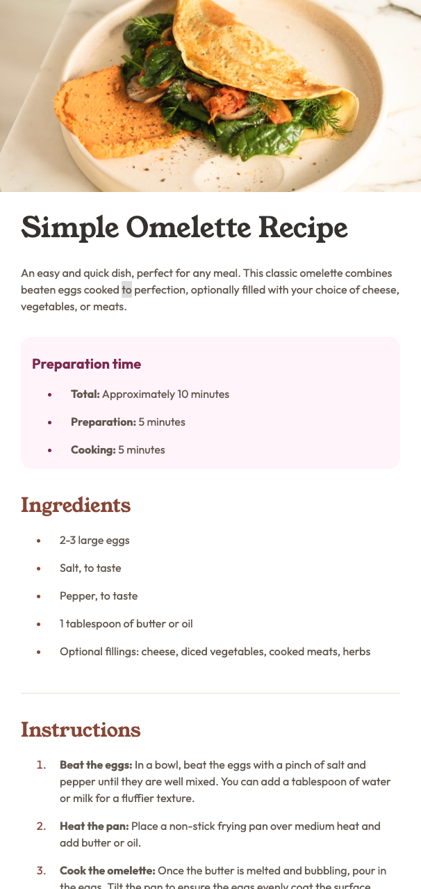

# Frontend Mentor - Recipe page solution

This is my solution to the [Recipe page challenge on Frontend Mentor](https://www.frontendmentor.io/challenges/recipe-page-KiTsR8QQKm).

## Table of contents

- [Overview](#overview)
  - [Screenshot](#screenshot)
  - [Links](#links)
  - [My process](#my-process)
  - [Built with](#built-with)
  - [What I learned](#what-i-learned)
  - [Continued development](#continued-development)
  - [Useful resources](#useful-resources)
- [Author](#author)

## Overview

The goal was to create a simple and responsive recipe page using HTML and CSS, I went for a mobile first approach. This was built as part of my learning journey, I've been programming for around 3 months and this is my first completed project from scratch.

### Screenshot

### Links

- Live Site URL: (https://unrivaled-torrone-271400.netlify.app/)

## My process

I started by building out the semantic HTML structure, making sure to use proper tags.

Once the structure was in place, I set up my CSS variables for colors, font sizes, and spacing to keep the styling consistent. I also used @layers to help organize my CSS as best as I could.

From there, I began styling from the top of the page down, working section by section to match the Figma design as closely as possible.

I finished by adding responsive breakpoints for tablet and desktop, ensuring the layout stayed clean across all screen sizes.

### Built with

- Semantic HTML5 markup
- CSS custom properties
- Mobile-first workflow

### What I learned

While working on this challenge, I reinforced:

Structuring HTML semantically for better accessibility (using <section>, <article>, <header>, <main>, etc).

Styling tables with custom borders and removing the last border line for a cleaner look.

Creating responsive layouts that adapt to tablet and desktop breakpoints without breaking the design.

Applying consistent border-radius and background colors for a polished look.

### Continued development

I want to focus more on:
Creating better variables and organizing my CSS.

Improving accessibility features such as aria-label and proper heading hierarchy.

Adding subtle animations for a more interactive feel.

### Useful resources

- [Frontend Masters](https://www.frontendmasters.com) - Their courses have really helped me improve my HTML and CSS skills. I found their teaching style clear and practical, which made it easier to apply concepts in this project.

## Author

- Frontend Mentor - [@nextechnician](https://www.frontendmentor.io/profile/nextechnician)
